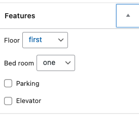

# House Ajax Fliter Wordpress Plugin
Simple plugin to filter by *AJAX* technology in Wordpress.

This plugin uses the options and after clicking `Apply Filter`, it sends the request to backend. The returned response contains only the requested (filtered) data.

# How to use
After installing the plugin:
1. go to `Setting` >> `Permalink` and check `Post name`
2. create `Add New` in `Houses`
3. create new page and use this shortcode `[HouseAjaxFilter]`

